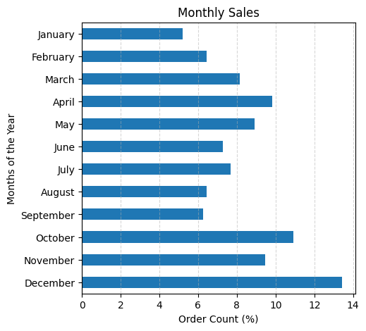
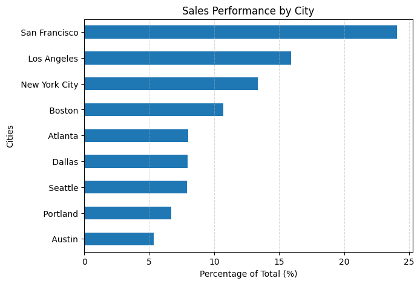
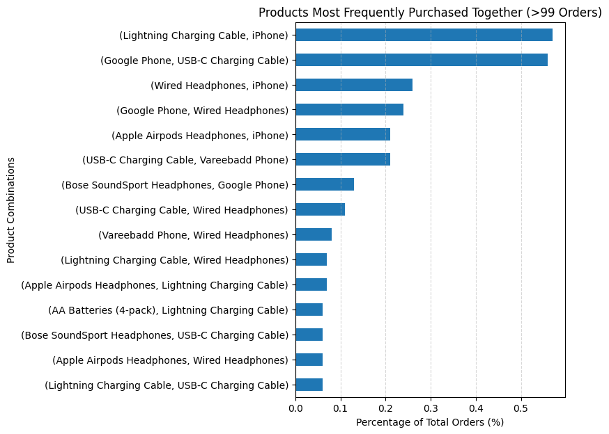

# Elist Electronics: Annual Sales Performance Analysis

## 1. Project Background

Elist Electronics, a global e-commerce company established in 2018, has a significant amount of data on its sales, marketing efforts, and product offerings. After a period of rapid growth, the company's sales have begun to plateau.

This project was initiated to thoroughly analyze and synthesize one year of sales data to uncover critical insights that will improve Elist's commercial success. The goal is to provide data-driven recommendations to the marketing and sales teams to optimize advertising spend, increase average order value (AOV), and drive revenue growth in key markets.

---

## 2. Executive Summary

This analysis of 12 months of sales data provides actionable insights into customer purchasing behavior. After peaking in late 2021, the company’s sales have shown a year-over-year decline across key metrics. This report identifies the primary drivers of sales and offers recommendations to reverse this trend.

### Overview of Findings:
*   **Peak Purchasing Times:** Sales volume is highest in **December**, with daily peaks occurring around **11 AM-1 PM** and **7 PM**.
*   **Top Performing Market:** **San Francisco, CA** is the most significant market, generating the highest revenue and order volume.
*   **Key Cross-Sell Opportunity:** **iPhones and charging cables** are the most frequently purchased product pair, highlighting a strong opportunity for product bundling.
*   **Primary Sales Challenge:** The majority of orders contain only a single item. Increasing the average quantity per order is the most direct path to boosting revenue.

---

## 3. Data Structure & Initial Checks

The analysis is based on a relational database structure consisting of four tables: `orders`, `customers`, `geo_lookup`, and `order_status`. The dataset contains a total row count of **185,950 records**.

#### Entity Relationship Diagram (ERD)

---

## 4. Insights & Recommendations (Deep Dive)

### ❓ Business Question 1: When is the best time to run advertising campaigns?

**Insight:** Sales peak significantly during the holiday season (**October-December**), with December being the top-performing month. On a daily basis, the most orders occur around lunchtime (**11 AM - 1 PM**) and in the evening (**6 PM - 8 PM**).

**Recommendation:** Concentrate marketing spend during peak months and hours to maximize ROI. Launch holiday campaigns starting in late October and run targeted digital ads during the 11 AM-1 PM and 6 PM-8 PM time slots.

### ❓ Business Question 2: Which geographic locations are our top markets?

**Insight:** **San Francisco, CA** is the leading market in terms of both order volume and total revenue, followed by Los Angeles and New York City.

**Recommendation:** Allocate larger marketing budgets and potentially localized promotions to the top 3 cities. For underperforming but high-potential cities like Seattle, consider running targeted pilot campaigns to test market responsiveness.

### ❓ Business Question 3: What products are most frequently sold together?

**Insight:** High-demand items like the **iPhone** are frequently purchased with **Lightning Charging Cables** and **Wired Headphones**.

**Recommendation:** Create "smart bundles" (e.g., an "iPhone Essentials Kit") with a small discount to increase AOV. Implement a "Frequently Bought Together" recommendation engine on product pages to automate cross-selling.

---

## 5. Technical Appendix

This section contains the technical details of the project.

#### 🛠️ Tech Stack & Tools
*   **Language:** Python 3
*   **Libraries:** Pandas, Matplotlib, NumPy
*   **Environment:** Jupyter Notebook

#### 📂 File Structure
-   `data/`: Contains the raw CSV sales data.
-   `notebooks/`: Includes the main Jupyter Notebook (`Sales_Analysis.ipynb`).
-   `images/`: Stores all visualization outputs.
-   `README.md`: Project summary.
-   `requirements.txt`: List of Python dependencies.

#### 🔗 Code Links
-   **Data Cleaning & Merging:** [View the Python script here](./notebooks/Sales_Analysis.ipynb#data-cleaning)
-   **Product Bundle Analysis:** [View the Python script here](./notebooks/Sales_Analysis.ipynb#bundle-analysis)

#### ⚙️ Installation & Setup
1.  Clone the repository: `git clone https://github.com/SelimNajaf/Sales-Analysis-Project.git`
2.  Navigate to the directory: `cd Sales-Analysis-Project`
3.  Install dependencies: `pip install -r requirements.txt`
4.  Launch Jupyter Notebook: `jupyter notebook`

---

## 6. Caveats & Assumptions

*   **Timeframe:** The dataset covers a single year. Therefore, long-term year-over-year trends and multi-year seasonality cannot be definitively confirmed.
*   **Customer Data:** No demographic data (age, gender) was available for customers, limiting the potential for deeper segmentation.
*   **Address Parsing:** The purchase address was a single string that was parsed into City and State. This process assumes a consistent address format and may have minor inaccuracies.

---

## 7. Future Work

*   **Customer Segmentation:** Implement an RFM (Recency, Frequency, Monetary) analysis to identify high-value, loyal, and at-risk customer segments for targeted marketing.
*   **Sales Forecasting:** Develop a predictive model using time-series analysis (e.g., Prophet) to forecast future sales and optimize inventory.
*   **Interactive Dashboard:** Deploy the analysis into a fully interactive Tableau or Power BI dashboard for ongoing stakeholder use.

---

## 📬 Contact
**Selim Najaf**

*   **LinkedIn:** [linkedin.com/in/selimnajaf-data-analyst](https://www.linkedin.com/in/selimnajaf-data-analyst/)
*   **GitHub:** [github.com/SelimNajaf](https://github.com/SelimNajaf)
